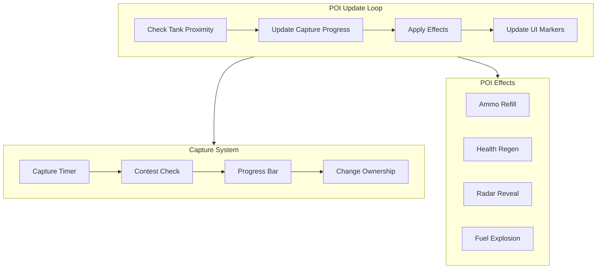

# Функциональная система POI

## Архитектура

## Этап 1: Система захвата точек контроля

Файлы: [src/client/poiSystem.ts](src/client/poiSystem.ts), [src/client/game.ts](src/client/game.ts)

**Функциональность:**

- Таймер захвата (30 секунд в зоне)
- Контест: если враг попадает в ту же зоне захвата - захват останавливается (тех кого больше находиться в зоне в момент захвата, те и захватывают)
- Прогресс захвата от 0 до 100%
- Смена владельца (player/enemy/neutral)
- Бонусы за удержание: +XP и +Credits каждые N секунд
- Возможность выбора точки респавна на захваченной точке

## Этап 2: Склады боеприпасов

Файл: [src/client/poiSystem.ts](src/client/poiSystem.ts)

**Функциональность:**

- Требует захвата для использования (захват 10 секунд)
- Авто-пополнение патронов в зоне (+1 снаряд/сек)
- Ящики с боеприпасами для подбора
- Ограниченный запас (100 снарядов, уменьшается)
- Периодический респавн запаса (каждые 60 сек)
- Специальные снаряды: спавняться рандомно и редко бронебойные (+20% урона), фугасные (splash damage). эти снаряды должны отличаться визуально.

## Этап 3: Ремонтные станции

Файл: [src/client/poiSystem.ts](src/client/poiSystem.ts)

**Функциональность:**

- Требует захвата для использования (захват 10 секунд)
- Авто-восстановление HP в зоне (+5% HP/сек)
- Ремонт повреждённых модулей
- Кулдаун между использованиями (30 сек после выхода)
- Визуальный эффект ремонта (искры/сварка)

## Этап 4: Топливные склады

Файл: [src/client/poiSystem.ts](src/client/poiSystem.ts)

**Функциональность:**

- Требует захвата для использования (захват 10 секунд)
- Пополнение топливных баков (+10 L/сек) [создать дополнительно топливную систему для танков (если кончаеться топливо, то танк больше просто не едет)(за топливом можно заехать в гараж или на топливный склад)(создай так же значёк с показателями топлива и состояния танка)]
- Взрыв при попадании снаряда в топливные баки (респавн баков 3 минуты)
- Урон в радиусе 15м (50-100 HP в зависимости от расстояния)
- Эффектный взрыв (огонь, дым, обломки)
- После взрыва - остаётся разрушенная заправочная станция воронка/руины, обломки 

## Этап 5: Радарные станции

Файл: [src/client/poiSystem.ts](src/client/poiSystem.ts)

**Функциональность:**

- Требует захвата для использования (захват 30 секунд)
- После захвата: показывает врагов на миникарте в радиусе 300м (всем союзникам в радиусе 100 метров от радарной станции)
- 3D маркеры врагов в мире и/или на карте 
- Периодический пинг (каждые 3 секунды)

## Этап 6: UI индикаторы

Файлы: [src/client/hud.ts](src/client/hud.ts), [src/client/poiSystem.ts](src/client/poiSystem.ts)

**Функциональность:**

- HUD-маркеры POI в 3D мире (иконки над точками)
- Отображение расстояния до POI
- Статус: neutral (серый), player (зелёный), enemy (красный), contested (жёлтый)
- Прогресс-бар захвата
- Уведомления: "Точка захвачена!", "Точка потеряна!", "Склад пуст!"

## Интеграция с игрой

- POI обновляются в главном игровом цикле (`game.ts`)
- Эффекты применяются к танку игрока и ботам
- Боты будут использовать POI (патрулировать, захватывать)

## Порядок реализации

1. **Этап 1** - Система захвата 
2. **Этап 2** - Склады боеприпасов 
3. **Этап 3** - Ремонтные станции 
4. **Этап 4** - Топливные склады 
5. **Этап 5** - Радарные станции 
6. **Этап 6** - UI индикаторы