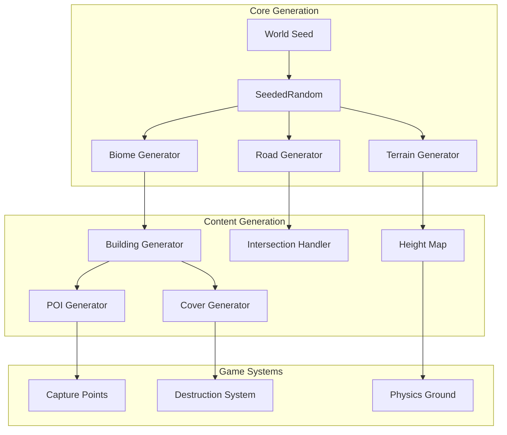

# Совершенствование процедурного генератора карт

## Архитектура системы



## Этап 1: Управление сидом в меню

Файлы: [src/client/menu.ts](src/client/menu.ts), [src/client/chunkSystem.ts](src/client/chunkSystem.ts)

- Добавить поле ввода сида в настройки меню
- Кнопка "Случайный сид" 
- Кнопка "Копировать сид"
- Передача сида в ChunkSystem при создании игры

## Этап 2: Дорожная сеть

Файл: [src/client/chunkSystem.ts](src/client/chunkSystem.ts)

Новый класс `RoadNetwork`:

- Генерация магистралей (главные дороги через всю карту)
- Сетка улиц в городских биомах
- Органические дороги в парковых/пустынных зонах
- Перекрёстки с правильной геометрией
- Разметка дорог (полосы, пешеходные переходы)
```typescript
interface RoadSegment {
    start: Vector3;
    end: Vector3;
    width: number;
    type: "highway" | "street" | "path";
}
```


## Этап 3: Рельеф местности

Файл: [src/client/chunkSystem.ts](src/client/chunkSystem.ts)

- Noise-based heightmap (Perlin/Simplex noise)
- Холмы в определённых биомах
- Овраги и долины
- Кратеры от бомбардировок
- Пандусы и наклонные поверхности
- Интеграция с физикой (наклонные коллайдеры)
```typescript
private getTerrainHeight(worldX: number, worldZ: number): number {
    const baseNoise = this.noise2D(worldX * 0.01, worldZ * 0.01);
    const detailNoise = this.noise2D(worldX * 0.05, worldZ * 0.05) * 0.3;
    return (baseNoise + detailNoise) * this.maxTerrainHeight;
}
```


## Этап 4: Укрытия и препятствия

Файл: [src/client/chunkSystem.ts](src/client/chunkSystem.ts)

Новые методы генерации:

- `createContainer()` - морские контейнеры (штабелируемые)
- `createWreckedCar()` - разбитые машины разных типов
- `createBarricade()` - бетонные блоки, мешки с песком
- `createTrench()` - окопы и траншеи
- `createRubble()` - завалы и обломки
- `createVegetation()` - кусты, деревья (в зависимости от биома)

Логика размещения:

- Вдоль дорог
- На перекрёстках
- Возле зданий
- В стратегических точках

## Этап 5: Точки интереса (POI)

Файл: [src/client/chunkSystem.ts](src/client/chunkSystem.ts), новый файл [src/client/poiSystem.ts](src/client/poiSystem.ts)

Типы POI:

- Точки захвата (флаги) - генерируются в стратегических местах
- Склады боеприпасов - возле военных баз
- Ремонтные станции - в гаражах/промзонах
- Топливные склады (взрывающиеся) - в промзонах
- Мосты - над реками/оврагами
- Радарные станции - на высотах

Каждый POI:

- Уникальная визуализация
- Маркер на миникарте
- Игровая механика

## Этап 6: Система разрушаемости

Новый файл: [src/client/destructionSystem.ts](src/client/destructionSystem.ts)

```typescript
interface Destructible {
    mesh: Mesh;
    health: number;
    maxHealth: number;
    type: "wall" | "building_part" | "car" | "tree";
    onDestroy: () => void;
}
```

Механика:

- Стены и заборы разрушаются от попаданий
- Части зданий отваливаются
- Машины взрываются
- Деревья падают
- Обломки создают новые укрытия

## Структура файлов

```
src/client/
├── chunkSystem.ts        (модифицировать)
├── menu.ts               (модифицировать)
├── roadNetwork.ts        (новый)
├── terrainGenerator.ts   (новый)
├── coverGenerator.ts     (новый)
├── poiSystem.ts          (новый)
├── destructionSystem.ts  (новый)
└── noiseGenerator.ts     (новый - Perlin/Simplex)
```

## Порядок реализации

1. **Этап 1** - Управление сидом (30 мин)
2. **Этап 2** - Дорожная сеть (2-3 часа)
3. **Этап 3** - Рельеф (2 часа)
4. **Этап 4** - Укрытия (1-2 часа)
5. **Этап 5** - POI (1-2 часа)
6. **Этап 6** - Разрушаемость (2-3 часа)

Общее время: ~10-13 часов работы

## Примечания

- Все генераторы используют SeededRandom для воспроизводимости
- Чанковая система остаётся основой для бесконечной карты
- Оптимизация: объекты создаются только в загруженных чанках
- Биомы определяют стиль всех элементов внутри них