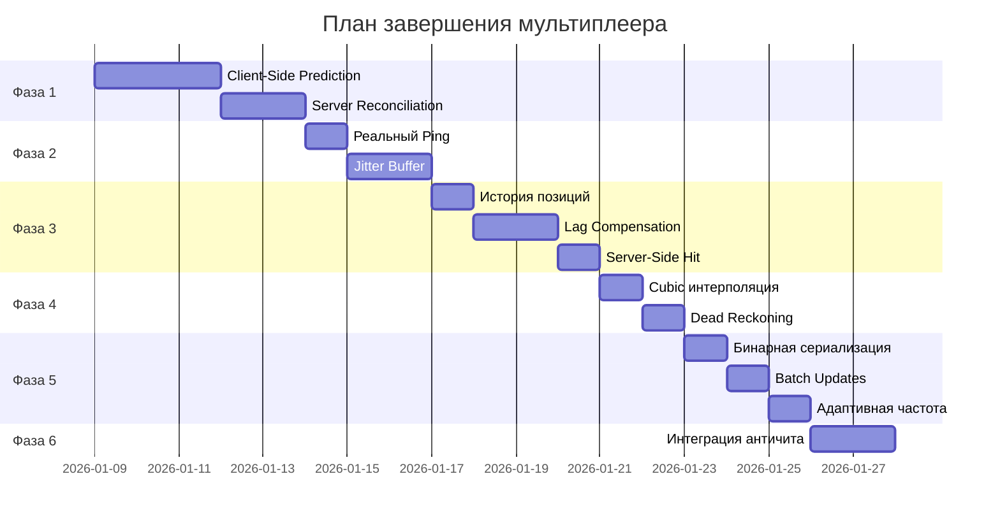

# План завершения мультиплеера Protocol TX

## Текущее состояние мультиплеера (85%)

### Что уже реализовано

| Компонент | Статус | Файл |

|-----------|--------|------|

| WebSocket сервер 60Hz | 100% | `src/server/gameServer.ts` |

| Базовая интерполяция | 70% | `src/client/networkPlayerTank.ts` |

| Delta-компрессия с квантизацией | 90% | `src/server/deltaCompression.ts` |

| SpatialHashGrid | 100% | `src/server/deltaCompression.ts` |

| PrioritizedBroadcaster | 100% | `src/server/deltaCompression.ts` |

| InputValidator + RateLimiter | 100% | `src/server/validation.ts` |

| Aimbot/SpeedHack detection | 90% | `src/server/validation.ts` |

| Бинарная сериализация | 0% (отключена) | `src/shared/protocol.ts` |

| Ping измерение | 30% (структуры есть, хардкод 100ms) | `src/client/multiplayer.ts` |

### Что отсутствует (критично)

- Client-Side Prediction
- Server Reconciliation
- Lag Compensation на сервере
- Jitter Buffer
- Server-Side Hit Validation

---

## ФАЗА 1: Client-Side Prediction (4-5 дней)

### 1.1 Реализация предсказания на клиенте

**Цель:** Мгновенный отклик на ввод без ожидания сервера

**Файлы для изменения:**

- [src/client/multiplayer.ts](src/client/multiplayer.ts) - добавить PredictionManager
- [src/client/tankController.ts](src/client/tankController.ts) - интегрировать prediction
- [src/shared/types.ts](src/shared/types.ts) - добавить sequence numbers

**Структура данных (уже частично есть в multiplayer.ts):**

```typescript
interface PredictedState {
    sequence: number;
    timestamp: number;
    position: Vector3;
    rotation: number;
    turretRotation: number;
    input: PlayerInput;
}

interface ClientPredictionState {
    predictedStates: Map<number, PredictedState>;
    confirmedSequence: number;
    lastServerState: PlayerData | null;
    maxHistorySize: number; // 60 = 1 секунда при 60Hz
}
```

**Алгоритм:**

1. Каждый input получает уникальный `sequence++`
2. Input применяется локально СРАЗУ (prediction)
3. Input сохраняется в `predictedStates`
4. При получении серверного состояния - reconciliation

**Ожидаемый результат:** Воспринимаемая задержка: ~100ms -> ~0ms

### 1.2 Server Reconciliation

**Цель:** Синхронизация предсказания с серверным состоянием

**Файлы для изменения:**

- [src/client/multiplayer.ts](src/client/multiplayer.ts) - ReconciliationManager
- [src/server/gameServer.ts](src/server/gameServer.ts) - отправка confirmedSequence
- [src/shared/messages.ts](src/shared/messages.ts) - добавить sequence в PlayerStates

**Алгоритм:**

1. Сервер включает `lastProcessedSequence` в ответ
2. Клиент находит этот sequence в истории
3. Откатывает состояние к серверному
4. Re-apply все inputs после confirmedSequence

**Оптимизации:**

- Ограничение истории: 60 состояний (1 секунда)
- Бинарный поиск для confirmedSequence
- Batch reconciliation при множественных обновлениях

---

## ФАЗА 2: Реальный Ping и Jitter Buffer (2-3 дня)

### 2.1 Ping/Pong механизм

**Текущее состояние:** Хардкод 100ms в multiplayer.ts

**Файлы для изменения:**

- [src/client/multiplayer.ts](src/client/multiplayer.ts) - pingInterval уже есть!
- [src/server/gameServer.ts](src/server/gameServer.ts) - обработка PING

**Реализация (частично готова):**

```typescript
// multiplayer.ts - networkMetrics уже есть:
private networkMetrics: NetworkMetrics = {
    rtt: 100,        // Заменить на реальный
    jitter: 0,
    packetLoss: 0,
    lastPingTime: 0,
    pingHistory: []
};
```

**Задачи:**

1. Активировать ping/pong каждые 1000ms
2. Рассчитывать RTT: `rtt = currentTime - pingTimestamp`
3. EWMA сглаживание: `rtt = 0.875 * oldRtt + 0.125 * newRtt`
4. Рассчитывать jitter: стандартное отклонение RTT
5. Использовать реальный RTT вместо хардкода 100ms

### 2.2 Jitter Buffer

**Цель:** Сглаживание вариаций задержки

**Файл:** [src/client/multiplayer.ts](src/client/multiplayer.ts)

```typescript
class JitterBuffer {
    private buffer: BufferedUpdate[] = [];
    private targetDelay: number = 50; // ms
    
    addUpdate(update: BufferedUpdate): void {
        // Сортировка по sequence
    }
    
    getNextUpdate(currentTime: number): PlayerData[] | null {
        // Возвращать с задержкой targetDelay
    }
    
    adaptDelay(jitter: number): void {
        this.targetDelay = baseDelay + (jitter * 2);
    }
}
```

---

## ФАЗА 3: Lag Compensation на сервере (3-4 дня)

### 3.1 История позиций на сервере

**Файлы для изменения:**

- [src/server/player.ts](src/server/player.ts) - добавить positionHistory
- [src/server/projectile.ts](src/server/projectile.ts) - lag compensation
```typescript
// В ServerPlayer добавить:
interface PositionSnapshot {
    position: Vector3;
    rotation: number;
    timestamp: number;
}

positionHistory: PositionSnapshot[] = []; // Последние 1 секунда (60 snapshots)
```


### 3.2 Rewind Time для попаданий

**Алгоритм:**

1. При выстреле: получить RTT стрелявшего игрока
2. `rewindTime = currentTime - (RTT / 2)`
3. Найти ближайший snapshot в истории цели
4. Проверить попадание по исторической позиции

**Ограничения:**

- Максимальный rewind: 300ms
- Если RTT > 600ms: использовать текущую позицию

### 3.3 Server-Side Hit Validation

**Цель:** Сервер проверяет ВСЕ попадания

**Текущее состояние:** Клиент отправляет результат попадания

**Изменения:**

1. Клиент отправляет только выстрел (позиция, направление)
2. Сервер симулирует траекторию снаряда
3. Сервер проверяет коллизии с игроками
4. Сервер отправляет подтверждение попадания

---

## ФАЗА 4: Улучшенная интерполяция (2 дня)

### 4.1 Cubic интерполяция

**Файл:** [src/client/networkPlayerTank.ts](src/client/networkPlayerTank.ts)

**Текущее:** Линейная интерполяция

**Улучшение:** Hermite или Catmull-Rom сплайн

```typescript
// Hermite interpolation
function hermiteInterpolate(
    p0: Vector3, v0: Vector3,  // Предыдущая позиция и скорость
    p1: Vector3, v1: Vector3,  // Текущая позиция и скорость
    t: number                   // 0-1
): Vector3 {
    const t2 = t * t;
    const t3 = t2 * t;
    
    const h1 = 2*t3 - 3*t2 + 1;
    const h2 = t3 - 2*t2 + t;
    const h3 = -2*t3 + 3*t2;
    const h4 = t3 - t2;
    
    return p0.scale(h1)
        .add(v0.scale(h2))
        .add(p1.scale(h3))
        .add(v1.scale(h4));
}
```

### 4.2 Dead Reckoning (экстраполяция)

При пропуске обновлений:

```typescript
predictedPos = lastPos + velocity * deltaTime;
```

Ограничение: max 500ms экстраполяции

### 4.3 Адаптивная скорость интерполяции

| Ping | Коэффициент |

|------|-------------|

| < 50ms | 0.3 (быстрая) |

| 50-150ms | 0.2 (нормальная) |

| > 150ms | 0.1 (медленная) |

---

## ФАЗА 5: Оптимизация протокола (2-3 дня)

### 5.1 Включение бинарной сериализации

**Файл:** [src/shared/protocol.ts](src/shared/protocol.ts)

**Текущее состояние:** `USE_BINARY_SERIALIZATION = false` (отключено из-за багов)

**Задачи:**

1. Исправить `deserializeFromBinary()` - проблема с маркерами типов
2. Проверить обработку Vector3
3. Включить: `USE_BINARY_SERIALIZATION = true`
4. Протестировать на всех типах сообщений

**Ожидаемый результат:** Размер сообщений -40-60%

### 5.2 Batch Updates

**Файл:** [src/server/gameServer.ts](src/server/gameServer.ts)

```typescript
interface BatchMessage {
    type: "batch";
    data: {
        updates: Array<{
            type: ServerMessageType;
            data: any;
        }>;
    };
}
```

Группировать все обновления за тик в одно сообщение.

### 5.3 Адаптивная частота обновлений

Уже есть в `PrioritizedBroadcaster.getAdaptiveUpdateRate()`:

| Расстояние | Частота |

|------------|---------|

| < 150 | 60 Hz (100%) |

| 150-300 | 42 Hz (70%) |

| 300-500 | 24 Hz (40%) |

| > 500 | 12 Hz (20%) |

**Задача:** Интегрировать в gameServer.ts

---

## ФАЗА 6: Расширенный античит (2 дня)

### 6.1 Статистический анализ

**Уже реализовано в validation.ts:**

- `detectAimbot()` - анализ паттернов прицеливания
- `detectSpeedHack()` - анализ скорости движения
- `performStatisticalAnalysis()` - комплексный анализ

**Задача:** Интегрировать в gameServer.ts

### 6.2 Улучшенный Rate Limiting

**Уже реализовано:**

```typescript
class RateLimiter {
    checkLimit(playerId: string, actionType: string, maxPerSecond: number): boolean
}
```

**Рекомендуемые лимиты:**

- Input: 60/сек
- Shoot: 10/сек
- Chat: 5/сек

### 6.3 Автоматические баны

```typescript
if (suspiciousScore > 100) {
    // Временный бан 5 минут
}
if (suspiciousScore > 200) {
    // Бан на 1 час
}
if (suspiciousScore > 500) {
    // Перманентный бан
}
```

---

## План выполнения



---

## Метрики успеха

| Метрика | Текущее | После фазы 1 | После фазы 3 | Финал |

|---------|---------|--------------|--------------|-------|

| Воспринимаемая задержка | ~100ms | ~0ms | ~0ms | ~0ms |

| Размер сообщений | ~500 байт | ~500 байт | ~500 байт | ~200 байт |

| Стабильность при 200ms ping | Плохая | Хорошая | Отличная | Отличная |

| Честность попаданий | Клиентская | Клиентская | Серверная | Серверная |

| Античит | Базовый | Базовый | Базовый | Расширенный |

---

## Оценка времени

| Фаза | Задачи | Время |

|------|--------|-------|

| 1. Client-Side Prediction | Prediction + Reconciliation | 4-5 дней |

| 2. Ping и Jitter | Ping/Pong + Jitter Buffer | 2-3 дня |

| 3. Lag Compensation | История + Rewind + Hit Validation | 3-4 дня |

| 4. Интерполяция | Cubic + Dead Reckoning | 2 дня |

| 5. Оптимизация | Binary + Batch + Adaptive | 2-3 дня |

| 6. Античит | Интеграция + Баны | 2 дня |

| **ИТОГО** | | **15-19 дней** |

---

## Вопрос

С какой фазы начнём?

1. **Фаза 1: Client-Side Prediction** - самое важное для отзывчивости
2. **Фаза 2: Реальный Ping** - быстро реализовать, структуры уже есть
3. **Фаза 5: Бинарная сериализация** - исправить и включить (быстрый результат)
4. **Всё по порядку** - начать с фазы 1 и идти последовательно