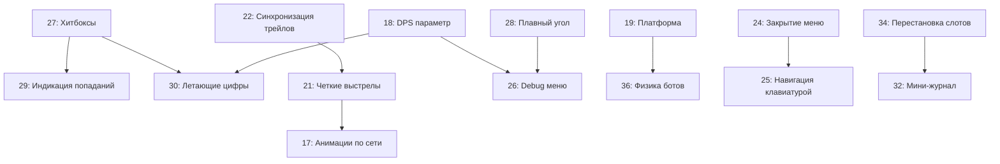

# План исправления 20 задач TX

## 🎯 Обзор

Этот план охватывает 21 задачу по улучшению танкового симулятора, включая критичные исправления багов, сетевые анимации, физику, UI/UX, и игровую механику.

---

## 📋 Задачи по категориям

### 🐛 Критичные баги (1 задача)

#### 0. Исправить ошибку deltaTime в updateHealth ⚠️

**Файлы:** [`src/client/hud.ts`](src/client/hud.ts)

**Проблема:** В методе `updateHealth()` (строка 585) происходит обращение к переменной `deltaTime`, которая не определена в области видимости метода. Это вызывает ошибку `ReferenceError: deltaTime is not defined` при пассивном ремонте танка.

**Решение:**

- Удалить обновление `lowHpVignetteComponent` из метода `updateHealth()` (строки 584-586)
- Виньетка низкого здоровья уже обновляется в основном методе `update(deltaTime, camera?)` (строка 614), который вызывается каждый кадр из игрового цикла
- Оставить только установку флага `this.isLowHp` (строка 583) и отключение legacy компонента (строки 588-593)

**Приоритет:** Критичный (блокирует игру)

### 🌐 Мультиплеер и Сетевая Синхронизация (5 задач)

#### 17. Анимации танков по сети ✨

**Файлы:** [`src/client/networkPlayerTank.ts`](src/client/networkPlayerTank.ts), [`src/client/effects.ts`](src/client/effects.ts), [`src/client/garage.ts`](src/client/garage.ts)

**Проблема:** Не видны эффекты спавна, респавна, смерти, переодевания и выхода с битвы у других игроков.

**Решение:**

- В `networkPlayerTank.ts` уже есть заглушки `playSpawnEffect()` (строка 574) и `playDeathEffect()` (строка 581)
- Добавить вызовы эффектов при изменении статуса (spawn, death, respawn)
- **КРИТИЧНО: Эффект "переодевания" при смене ЛЮБОГО элемента танка:**
- Пушка (cannonType) - золотистое свечение ствола
- Корпус (chassisType) - голубое свечение корпуса
- Гусеницы (trackType) - искры от гусениц
- Модули (modules) - зеленое свечение точек крепления
- Эффект: частицы + свечение + звук "клик-установка"
- Длительность: 0.5 секунды
- Добавить эффект "выход с битвы" (телепорт вверх + fade out)
- Использовать `EffectsManager.createTeleportEffect()` и `createExplosion()`
- В гараже при смене деталей локального танка тоже показывать эффект

#### 20. Автообновление лобби 🔄

**Файлы:** [`src/client/networkMenu.ts`](src/client/networkMenu.ts), [`src/server/room.ts`](src/server/room.ts)

**Проблема:** Список игроков в лобби не обновляется при подключении/отключении других игроков.

**Решение:**

- Сервер должен отправлять broadcast `player_joined` и `player_left` всем в комнате
- Клиент должен слушать эти события и обновлять UI лобби в реальном времени
- Добавить обработчики в `MultiplayerManager` для этих событий

#### 21. Четкие выстрелы без лагов 🎯

**Файлы:** [`src/client/game/GameMultiplayerCallbacks.ts`](src/client/game/GameMultiplayerCallbacks.ts), [`src/client/game/NetworkProjectile.ts`](src/client/game/NetworkProjectile.ts)

**Проблема:** Снаряды лагают, трейлы дергаются.

**Решение:**

- Улучшить client-side prediction для снарядов
- Увеличить tick rate отправки позиций снарядов (сейчас ~30Hz, нужно 60Hz)
- Добавить интерполяцию позиций снарядов на клиенте
- Оптимизировать `NetworkProjectile.update()` для плавного движения

#### 22. Синхронизация трейлов 🌟

**Файлы:** [`src/client/effects.ts`](src/client/effects.ts), [`src/client/tankController.ts`](src/client/tankController.ts), [`src/client/game/NetworkProjectile.ts`](src/client/game/NetworkProjectile.ts)

**Проблема:** Трейлы снарядов разные в одиночной игре и мультиплеере.

**Решение:**

- Унифицировать параметры трейлов: использовать одну функцию `createBulletTrail()` везде
- В `NetworkProjectile` (строка 32-37) уже используется `createBulletTrail()`, но с дефолтным цветом
- Передавать `cannonType` в `createNetworkProjectile()` для правильного цвета трейла
- Синхронизировать параметры: `maxSegments=12`, `alpha=0.7`, длину и толщину

#### 35. Мгновенная телепортация при респавне ⚡

**Файлы:** [`src/client/networkPlayerTank.ts`](src/client/networkPlayerTank.ts), [`src/client/multiplayer.ts`](src/client/multiplayer.ts)

**Проблема:** Респавн происходит с анимацией перемещения вместо мгновенной телепортации.

**Решение:**

- В `networkPlayerTank.ts` добавить флаг `needsRespawnTeleport`
- При респавне (`setAlive()`, строка 772) установить флаг
- В `update()` проверять флаг и делать мгновенную телепортацию (как `needsInitialSync` на строке 409-424)

---

### 🎮 Игровая Механика и Физика (6 задач)

#### 18. DPS параметр для пушек 📊

**Файлы:** [`src/client/tankTypes.ts`](src/client/tankTypes.ts), [`src/client/garage/ui.ts`](src/client/garage/ui.ts), [`src/client/hud.ts`](src/client/hud.ts)

**Проблема:** Нет параметра DPS (damage per second).

**Решение:**

- Добавить в `CannonType` interface: `dps?: number` (рассчитывается как `damage / (cooldown / 1000)`)
- Добавить функцию `calculateDPS(cannon: CannonType): number`
- Показывать DPS в гараже при выборе пушки
- Показывать DPS в HUD в МЕНЮ "ХАРАКТЕРИСТИКИ" В БЛОКЕ ПУШКИ

#### 19. Починить модуль "платформа" 🛠️

**Файлы:** [`src/client/tankController.ts`](src/client/tankController.ts), [`src/client/consumables.ts`](src/client/consumables.ts)

**Проблема:** Танк дергается/глючит на платформе из-за физических конфликтов.

**ОПТИМАЛЬНОЕ РЕШЕНИЕ (без отключения физики):**

1. **Создать невидимую кинематическую платформу-лифт:**

- PhysicsBody с `ANIMATED` motion type (не подвержен физике, но влияет на других)
- Размер: чуть больше танка (для надёжного контакта)
- Прозрачный mesh с визуальным эффектом (энергетическое поле)

2. **Механика подъёма:**

- Платформа плавно поднимается снизу вверх за 2 секунды
- Скорость подъема: `liftSpeed = targetHeight / 2.0` (м/с)
- Танк остаётся на платформе благодаря физическому контакту
- Используем `setLinearVelocity()` для плавного движения платформы

3. **Предотвращение глюков:**

- При активации: временно увеличить `friction` танка на платформе (0.9)
- Заблокировать движение танка на время подъёма (disable input)
- После достижения высоты: платформа исчезает через 0.5 сек (fade out)
- Танк плавно опускается обратно под действием gravity

4. **Высота подъёма:** 10-15 метров (настраиваемо)

**Почему это лучше:**

- Сохраняется физическая целостность (нет телепортов)
- Реалистичное взаимодействие через PhysicsEngine
- Нет конфликтов между физикой танка и платформы
- Визуально красиво и понятно

#### 27. Хитбоксы - упрощенная форма танка 📦

**Файлы:** [`src/client/tankController.ts`](src/client/tankController.ts), [`src/server/room.ts`](src/server/room.ts), [`src/server/player.ts`](src/server/player.ts)

**Проблема:** Хитбоксы огромные и сферические. Нужны точные по форме танка.

**Решение (УПРОЩЕНО до 2 блоков):**

- Клиент: Создать 2 PhysicsAggregate (BOX) для каждого танка:

1. **Корпус (chassis)** - основной блок (уже есть)
2. **Башня (turret)** - меньший блок сверху (turretHitbox уже реализован)

- Сервер: Использовать OBB (Oriented Bounding Box) для проверки попаданий (уже есть на строке 456-461 в `room.ts`)
- Размеры брать из `CHASSIS_TYPES` (width, height, depth)

**СТАТУС:** turretHitbox уже реализован в tankController.ts (строки 1162-1172)

#### 28. Плавный угол ствола (0.00°) 🎯

**Файлы:** [`src/client/tankController.ts`](src/client/tankController.ts), [`src/client/tank/tankMovement.ts`](src/client/tank/tankMovement.ts), [`src/client/hud.ts`](src/client/hud.ts), [`src/client/enemyTank.ts`](src/client/enemyTank.ts)

**Проблема:** Угол ствола изменяется целыми градусами, нужны десятые доли.

**РЕШЕНИЕ (УЛУЧШЕННОЕ):**

1. **Изменить диапазон угла:**

- **От -12.50° до +12.50°** (симметричный диапазон для баланса)
- Текущий: -15° до +10° (строка 1847 в `enemyTank.ts`)
- В радианах: от -0.218 до +0.218 рад

2. **Увеличить точность:**

- `baseBarrelPitchSpeed = 0.00035` (строка 316 в `tankController.ts`) - уменьшить в 10 раз
- Шаг изменения: ~0.05° за кадр при 60 FPS
- Плавное изменение с интерполяцией

3. **Отображение в HUD:**

- В `hud.ts` функция `setBarrelAngle()` (строка 4843)
- Изменить `Math.round(angleDegrees)` на `angleDegrees.toFixed(2)`
- Формат: "-12.50°" или "+12.50°" с двумя знаками после запятой
- Цветовая индикация:
 - Зеленый: |угол| < 5°
 - Оранжевый: 5° ≤ |угол| < 10°
 - Красный: |угол| ≥ 10°

4. **Синхронизация для ботов:**

- Обновить `enemyTank.ts` с теми же диапазонами
- Ограничение: `Math.max(-0.218, Math.min(0.218, pitch))`

#### 31. Индикация малого здоровья ❤️

**Файлы:** [`src/client/hud.ts`](src/client/hud.ts), [`src/client/game.ts`](src/client/game.ts)

**Проблема:** Нет визуальной индикации критически низкого здоровья.

**Решение:**

- В HUD добавить красную пульсирующую рамку по краям экрана при HP < 30%
- Добавить звуковое предупреждение heartbeat (bpm увеличивается при снижении HP)
- Добавить красный оттенок health bar при HP < 20%

#### 36. Боты на маленьких корпусах 🤖

**Файлы:** [`src/client/enemyTank.ts`](src/client/enemyTank.ts), [`src/client/enemy.ts`](src/client/enemy.ts)

**Проблема:** Боты на маленьких корпусах (scout, racer) странно двигаются - вращаются по всем осям, едут слишком быстро.

**Решение:**

- Проблема: базовые физические параметры не масштабируются по размеру корпуса
- В `enemyTank.ts` изменить создание PhysicsAggregate: использовать `chassis.mass` и правильные `friction`/`restitution`
- Ограничить angular velocity для маленьких танков
- Нормализовать `moveSpeed` и `turnSpeed` относительно массы

---

### 🖥️ UI и UX Улучшения (9 задач)

#### 23. Меню "управление" свернуто по умолчанию 📋

**Файлы:** [`src/client/menu.ts`](src/client/menu.ts)

**Проблема:** Меню управления развернуто по умолчанию, занимает много места.

**Решение:**

- В `createControlsSection()` установить начальное состояние `display: none` для детального содержимого
- Добавить кнопку "Развернуть/Свернуть" в заголовок секции
- Сохранять состояние в localStorage

#### 24. Закрытие меню по ESC/клику вне 🚪

**Файлы:** [`src/client/menu.ts`](src/client/menu.ts), [`src/client/garage.ts`](src/client/garage.ts), [`src/client/networkMenu.ts`](src/client/networkMenu.ts), [`src/client/game.ts`](src/client/game.ts)

**Проблема:** Меню не закрываются по ESC или клику вне области.

**Решение:**

- Добавить глобальный обработчик `keydown` для ESC
- Добавить обработчик клика на backdrop (затемнение) за меню
- Закрывать текущее открытое меню (проверять `isMenuOpen`, `isGarageOpen`, etc.)
- В игре (паузе) ESC должен закрывать меню и возобновлять игру

#### 25. Навигация клавиатурой во всех меню ⌨️

**Файлы:** [`src/client/menu.ts`](src/client/menu.ts), [`src/client/garage.ts`](src/client/garage.ts), [`src/client/networkMenu.ts`](src/client/networkMenu.ts)

**Проблема:** Навигация клавиатурой работает только в гараже.

**Решение:**

- Реализовать единую систему навигации:
- Tab/Shift+Tab - переход между элементами
- Enter/Space - выбор/активация
- Arrow keys - навигация в списках/сетках
- Добавить визуальный фокус (outline) на активном элементе
- Реализовать в главном меню, сетевом меню, настройках

#### 26. Расширить debug меню 🔧

**Файлы:** [`src/client/debugDashboard.ts`](src/client/debugDashboard.ts), [`src/client/game.ts`](src/client/game.ts)

**Проблема:** Debug меню недостаточно информативно по производительности.

**РЕШЕНИЕ (С ПЕРЕКЛЮЧАТЕЛЯМИ):**

**1. Метрики производительности (с чекбоксами ВКЛ/ВЫКЛ):**

- ✅ **FPS Counter**
  - Min/Max/Avg за последние 60 кадров
  - График FPS (mini-chart, последние 5 секунд)
  - Цветовая индикация: зеленый >55, желтый 30-55, красный <30

- ✅ **Frame Time**
  - Время кадра в мс (target: 16.67ms для 60fps)
  - График frame time

- ✅ **Render Stats**
  - Draw calls
  - Triangles/vertices count
  - Active meshes
  - Texture memory (если доступно)

- ✅ **Memory Usage** (если `performance.memory` доступен)
  - Used heap size
  - Total heap size
  - Heap limit

- ✅ **Network Stats** (только в мультиплеере)
  - Ping (RTT)
  - Jitter (вариация ping)
  - Packet loss %
  - Bandwidth (up/down)

- ✅ **Physics Stats**
  - Physics step time (ms)
  - Active bodies count
  - Collision checks per frame

- ✅ **Entity Count**
  - Tanks (players + enemies)
  - Projectiles (active)
  - Effects (particles)
  - Consumables (pickups)

**2. UI компоновка:**

```
┌─────────────────────────────────────┐
│ DEBUG MENU                    [X]   │
├─────────────────────────────────────┤
│ ☑ FPS Counter      [60.0 fps]   ▂▄▆█│
│ ☑ Frame Time       [16.5 ms]        │
│ ☐ Render Stats     [collapsed]      │
│ ☐ Memory Usage     [collapsed]      │
│ ☑ Network Stats    [45ms ping]      │
│ ☐ Physics Stats    [collapsed]      │
│ ☑ Entity Count     [12 entities]    │
├─────────────────────────────────────┤
│ [Toggle All] [Export Data]          │
└─────────────────────────────────────┘
```

**3. Функциональность переключателей:**

- Клик по чекбоксу - показать/скрыть метрику
- Состояние сохраняется в `localStorage`
- По умолчанию включены: FPS, Entity Count
- Горячая клавиша: F3 - быстрое включение всех метрик

**4. Дополнительные функции:**

- Кнопка "Export Data" - скачать CSV с метриками за последние 60 секунд
- Авто-пауза при падении FPS < 10 (опционально)
- Уведомления о проблемах производительности

#### 29. Индикация попаданий В игрока 🎯

**Файлы:** [`src/client/hud.ts`](src/client/hud.ts), [`src/client/game.ts`](src/client/game.ts)

**Проблема:** Нет визуальной индикации откуда прилетел урон.

**Решение:**

- Добавить направленные индикаторы попадания (как в шутерах)
- Красные маркеры по краям экрана, указывающие направление атаки
- Использовать `hitPosition` из `PlayerDamagedData`
- Fade out через 2 секунды

#### 30. Индикация урона - летающие цифры 💥

**Файлы:** [`src/client/hud/components/FloatingDamageNumbers.ts`](src/client/hud/components/FloatingDamageNumbers.ts), [`src/client/game.ts`](src/client/game.ts)

**Проблема:** Система летающих цифр урона пропала/не работает.

**Решение:**

- Проверить существующую реализацию в `FloatingDamageNumbers.ts`
- Убедиться что вызывается при нанесении урона (и получении)
- Добавить разные цвета: красный (урон врагу), оранжевый (получен урон), желтый (критический урон)
- Разный размер шрифта в зависимости от урона

#### 32. Мини-журнал заданий в стиле игры 📜

**Файлы:** [`src/client/hud.ts`](src/client/hud.ts)

**Проблема:** Журнал заданий не соответствует стилю игры.

**Решение:**

- Переделать дизайн мини-журнала:
- Полупрозрачный темный фон
- Зеленый/золотой текст (как в HUD)
- Компактное отображение (только активные задания)
- Анимация появления/исчезновения
- Прогресс-бар для заданий с прогрессом

#### 33. Полупрозрачный экран смерти 💀

**Файлы:** [`src/client/hud/components/DeathScreen.ts`](src/client/hud/components/DeathScreen.ts)

**Проблема:** Экран смерти полностью непрозрачный, не видно поле боя.

**Решение:**

- Изменить background alpha: `alpha: 0.4` (сейчас вероятно 0.8+)
- Оставить только панель с информацией о смерти непрозрачной
- Остальной фон сделать полупрозрачным (виньетка)

#### 34. Перестановка слотов 🎰

**Файлы:** [`src/client/hud.ts`](src/client/hud.ts)

**Проблема:** Неправильный порядок слотов.

**Решение:**

- Текущий порядок неизвестен, нужный: **МОДУЛИ (6-0) → ПРИПАСЫ (1-5) → АРСЕНАЛ (0-4) → АКТИВНЫЕ ЭФФЕКТЫ**
- В `createConsumablesDisplay()` (строка 2118) изменить layout
- Слева направо: модули, припасы, арсенал, активные эффекты
- Визуально разделить группы (небольшой gap)

---

## 🔧 Порядок выполнения

### Фаза 1: Критичные исправления (Приоритет: Высокий)

1. **Задача 0** - Исправить ошибку deltaTime в updateHealth (блокирует игру)
2. **Задача 27** - Хитбоксы (влияет на геймплей)
3. **Задача 21** - Четкие выстрелы (влияет на ощущения от игры)
4. **Задача 35** - Мгновенная телепортация респавна
5. **Задача 19** - Модуль платформа
6. **Задача 36** - Боты на маленьких корпусах

### Фаза 2: Сетевая синхронизация (Приоритет: Высокий)

6. **Задача 17** - Анимации танков по сети
7. **Задача 22** - Синхронизация трейлов
8. **Задача 20** - Автообновление лобби

### Фаза 3: UI/UX улучшения (Приоритет: Средний)

9. **Задача 24** - Закрытие меню (качество жизни)
10. **Задача 34** - Перестановка слотов
11. **Задача 30** - Летающие цифры урона
12. **Задача 29** - Индикация попаданий
13. **Задача 33** - Полупрозрачный экран смерти
14. **Задача 31** - Индикация малого здоровья
15. **Задача 23** - Меню управление свернуто

### Фаза 4: Дополнительные функции (Приоритет: Низкий)

16. **Задача 18** - DPS параметр
17. **Задача 28** - Плавный угол ствола
18. **Задача 26** - Расширить debug меню
19. **Задача 32** - Мини-журнал
20. **Задача 25** - Навигация клавиатурой

---

## ⚠️ Важные моменты (ОБНОВЛЕНО)

1. **Хитбоксы (27)**: Упрощенная форма = 5 прямоугольных блоков БЕЗ деталей модели
2. **Слоты (34)**: Порядок слева направо: МОДУЛИ → ПРИПАСЫ → АРСЕНАЛ → АКТИВНЫЕ ЭФФЕКТЫ
3. **Угол ствола (28)**: Диапазон от **-12.50° до +12.50°** (симметричный) с точностью до 0.01°
4. **Трейлы (22)**: Единая система для одиночной игры и мультиплеера
5. **Переодевание (17)**: Эффект при смене ЛЮБОГО элемента (пушка, корпус, гусеницы, модули)
6. **Платформа (19)**: Кинематическая платформа-лифт (БЕЗ отключения физики танка)
7. **Debug меню (26)**: Все метрики с переключателями ВКЛ/ВЫКЛ для тестов

---

## 📊 Оценка времени

- Фаза 1: ~8-10 часов (критичные исправления)
- Фаза 2: ~6-8 часов (сетевая синхронизация)
- Фаза 3: ~10-12 часов (UI/UX)
- Фаза 4: ~6-8 часов (дополнительные функции)

**Общее время: ~30-38 часов работы**

---

## 🔗 Карта зависимостей задач



**Критические пути:**

1. **Хитбоксы → Индикация попаданий → Урон** (влияет на геймплей)
2. **Трейлы → Выстрелы → Анимации** (визуальное восприятие)
3. **Физика → Платформа → Боты** (стабильность игры)

---

## 🧪 План тестирования

### Фаза 1: Критичные исправления

**Тестовые сценарии:**

**T0 - Исправление ошибки deltaTime:**

- [ ] Пассивный ремонт работает без ошибок в консоли
- [ ] Виньетка низкого здоровья обновляется корректно
- [ ] Нет ошибок `ReferenceError: deltaTime is not defined`
- [ ] HUD обновляется плавно при изменении здоровья
- [ ] Работает в одиночной игре и мультиплеере

**T27 - Хитбоксы:**

- [ ] Выстрел в корпус танка - попадание регистрируется
- [ ] Выстрел в башню - попадание регистрируется
- [ ] Выстрел в ствол - попадание регистрируется
- [ ] Выстрел между гусеницами - промах
- [ ] Попадание под разными углами (0°, 45°, 90°)
- [ ] Проверка на разных типах корпусов (racer, siege, scout)
- [ ] Мультиплеер: хитбоксы синхронизированы

**T21 - Четкие выстрелы:**

- [ ] Снаряд летит плавно без рывков (60 FPS)
- [ ] Трейл не отстает от снаряда
- [ ] Нет задержки между нажатием и выстрелом
- [ ] Попадание регистрируется точно в месте визуального контакта
- [ ] Тест на высоком пинге (100ms, 200ms, 300ms)

**T35 - Мгновенная телепортация:**

- [ ] Респавн происходит мгновенно
- [ ] Нет "проплывания" от старой позиции к новой
- [ ] Эффект телепорта проигрывается
- [ ] В мультиплеере другие игроки видят телепорт

**T19 - Платформа:**

- [ ] Платформа появляется под танком
- [ ] Подъем происходит плавно (2 секунды)
- [ ] Танк не дергается и не застревает
- [ ] На вершине танк стабилен
- [ ] Платформа исчезает корректно
- [ ] Работает на всех типах корпусов
- [ ] Не конфликтует с другими модулями

**T36 - Физика ботов:**

- [ ] Scout боты двигаются плавно
- [ ] Racer боты не вращаются хаотично
- [ ] Скорость соответствует характеристикам
- [ ] Нет "дрожания" на месте
- [ ] Правильная реакция на столкновения

### Фаза 2: Сетевая синхронизация

**T17 - Анимации:**

- [ ] Спавн: эффект телепорта виден всем
- [ ] Смерть: взрыв виден всем
- [ ] Переодевание пушки: золотистое свечение
- [ ] Переодевание корпуса: голубое свечение
- [ ] Переодевание гусениц: искры
- [ ] Переодевание модулей: зеленое свечение
- [ ] Выход с битвы: телепорт вверх
- [ ] Все эффекты синхронизированы с низким пингом
- [ ] Все эффекты работают при высоком пинге

**T22 - Синхронизация трейлов:**

- [ ] Трейлы одинаковые в одиночной/мульти
- [ ] Цвет соответствует типу пушки
- [ ] Длина и толщина идентичны
- [ ] Alpha = 0.7, segments = 12

**T20 - Автообновление лобби:**

- [ ] Новый игрок появляется в списке
- [ ] Отключившийся игрок исчезает
- [ ] Обновление происходит мгновенно
- [ ] Нет дублирования игроков
- [ ] Корректно работает при 10+ игроках

### Фаза 3: UI/UX

**T24 - Закрытие меню:**

- [ ] ESC закрывает все типы меню
- [ ] Клик вне меню закрывает его
- [ ] В игре ESC возобновляет игру
- [ ] Вложенные меню закрываются правильно

**T34 - Перестановка слотов:**

- [ ] Визуальный порядок: МОДУЛИ → ПРИПАСЫ → АРСЕНАЛ → ЭФФЕКТЫ
- [ ] Hotkeys работают правильно
- [ ] Gaps между группами видны
- [ ] Подсказки отображаются правильно

**T30 - Летающие цифры:**

- [ ] Урон врагу: красные цифры
- [ ] Получен урон: оранжевые цифры
- [ ] Критический урон: желтые большие
- [ ] Размер зависит от величины урона
- [ ] DPS учитывается в расчетах

**T29 - Индикация попаданий:**

- [ ] Маркеры появляются в правильном направлении
- [ ] Fade out через 2 секунды
- [ ] Не перекрывают важные элементы HUD
- [ ] Работают при множественных попаданиях

**T33 - Экран смерти:**

- [ ] Фон полупрозрачный (alpha 0.4)
- [ ] Поле боя видно сквозь фон
- [ ] Панель информации читаема
- [ ] Таймер респавна виден

**T31 - Малое здоровье:**

- [ ] Красная рамка при HP < 30%
- [ ] Пульсация усиливается при снижении HP
- [ ] Heartbeat звук синхронизирован
- [ ] Health bar красный при HP < 20%

**T23 - Меню управление:**

- [ ] По умолчанию свернуто
- [ ] Кнопка разворачивает/сворачивает
- [ ] Состояние сохраняется в localStorage

### Фаза 4: Дополнительные функции

**T18 - DPS параметр:**

- [ ] DPS рассчитывается правильно
- [ ] Отображается в гараже
- [ ] Отображается в HUD характеристик
- [ ] Обновляется при смене пушки

**T28 - Плавный угол:**

- [ ] Диапазон: -12.50° до +12.50°
- [ ] Отображение с двумя знаками: "12.50°"
- [ ] Цвета: зеленый/оранжевый/красный
- [ ] Плавное изменение 0.05°/кадр

**T26 - Debug меню:**

- [ ] Все чекбоксы работают
- [ ] Состояние сохраняется
- [ ] Export Data скачивает CSV
- [ ] F3 включает все метрики
- [ ] Графики обновляются в реальном времени

**T32 - Мини-журнал:**

- [ ] Стиль соответствует HUD
- [ ] Только активные задания
- [ ] Прогресс-бар анимирован
- [ ] Появление/исчезновение плавное

**T25 - Навигация клавиатурой:**

- [ ] Tab/Shift+Tab работает везде
- [ ] Enter/Space активирует элементы
- [ ] Arrow keys навигация в списках
- [ ] Визуальный фокус виден
- [ ] Работает в главном меню, гараже, настройках

---

## ⚡ Рекомендации по производительности

### Критичные для FPS:

**T27 - Хитбоксы (5 блоков на танк):**

- ⚠️ **Риск:** 10 танков × 5 блоков = 50 PhysicsBody
- ✅ **Оптимизация:** 
  - Использовать compound shapes вместо отдельных body
  - Отключить collision между частями одного танка
  - Использовать collision masks

**T21/T22 - Трейлы снарядов:**

- ⚠️ **Риск:** 12 сегментов × 20 снарядов = 240 мешей
- ✅ **Оптимизация:**
  - Использовать TrailMesh (встроенный в Babylon.js)
  - Pool снарядов (reuse вместо create/destroy)
  - Ограничить максимальное количество активных трейлов

**T26 - Debug меню:**

- ⚠️ **Риск:** Постоянные обновления метрик каждый кадр
- ✅ **Оптимизация:**
  - Обновлять только видимые метрики
  - Throttle обновлений до 10 Hz (не нужно 60 Hz)
  - Использовать requestAnimationFrame

**T30 - Летающие цифры:**

- ⚠️ **Риск:** Множество текстовых элементов GUI
- ✅ **Оптимизация:**
  - Object pool для текстовых блоков
  - Максимум 20 активных цифр одновременно
  - Fade out и reuse вместо destroy

### Целевые метрики:

- **FPS:** ≥ 60 на средних настройках
- **Frame Time:** ≤ 16.67ms
- **Physics Step:** ≤ 5ms
- **Draw Calls:** ≤ 500 (desktop), ≤ 300 (mobile)

---

## 🔄 Стратегия отката (Rollback)

### Git workflow:

1. **Создать feature branch** для каждой фазы:
   ```
   git checkout -b feature/phase-1-critical-fixes
   git checkout -b feature/phase-2-network-sync
   ```

2. **Commit после каждой задачи:**
   ```
   git commit -m "feat(T27): Implement 5-box hitboxes for tanks"
   ```

3. **Tag перед началом новой фазы:**
   ```
   git tag v0.4.1-pre-phase-2
   ```


### Rollback процедура:

```bash
# Откатить последний коммит
git revert HEAD

# Откатить всю фазу
git reset --hard v0.4.1-pre-phase-2

# Откатить конкретный файл
git checkout HEAD~1 -- src/client/tankController.ts
```

### Feature flags для критичных изменений:

```typescript
// В config или localStorage
const FEATURE_FLAGS = {
    NEW_HITBOXES: true,        // T27
    PLATFORM_LIFT: true,        // T19
    FLOATING_DAMAGE: true,      // T30
    DEBUG_MENU_V2: true,        // T26
};
```

---

## ⚙️ Конфигурационные параметры

Вынести в `src/client/config/gameConfig.ts`:

```typescript
export const GAME_CONFIG = {
    // T27 - Хитбоксы
    HITBOX: {
        USE_5_BOX_SYSTEM: true,
        INCLUDE_TRACKS: true,
        DEBUG_VISUALIZE: false, // Показать хитбоксы в debug режиме
    },
    
    // T19 - Платформа
    PLATFORM: {
        LIFT_HEIGHT: 12.5,      // метров
        LIFT_DURATION: 2.0,     // секунд
        FRICTION_BOOST: 0.9,
        DISABLE_CONTROLS: true,
    },
    
    // T28 - Угол ствола
    BARREL_PITCH: {
        MIN_ANGLE: -12.50,      // градусов
        MAX_ANGLE: 12.50,
        PRECISION: 0.01,        // шаг изменения
        SPEED: 0.00035,         // базовая скорость
    },
    
    // T22 - Трейлы
    PROJECTILE_TRAILS: {
        MAX_SEGMENTS: 12,
        ALPHA: 0.7,
        UPDATE_RATE: 60,        // Hz
        MAX_ACTIVE_TRAILS: 50,
    },
    
    // T26 - Debug меню
    DEBUG_MENU: {
        UPDATE_RATE: 10,        // Hz
        HISTORY_LENGTH: 60,     // секунд для графиков
        EXPORT_FORMAT: 'csv',
        AUTO_PAUSE_FPS: 10,     // автопауза при FPS < 10
    },
    
    // T30 - Летающие цифры
    DAMAGE_NUMBERS: {
        MAX_ACTIVE: 20,
        FADE_DURATION: 1.5,     // секунд
        FLOAT_SPEED: 30,        // пикселей/сек
        FONT_SIZE_BASE: 24,
        FONT_SIZE_CRIT: 36,
    },
    
    // T31 - Малое здоровье
    LOW_HEALTH: {
        WARNING_THRESHOLD: 0.30,  // 30%
        CRITICAL_THRESHOLD: 0.20, // 20%
        PULSE_SPEED: 1.5,         // секунд/цикл
        HEARTBEAT_BPM_BASE: 60,
        HEARTBEAT_BPM_CRIT: 140,
    },
};
```

---

## ✅ Checklist завершения задачи

Для каждой задачи проверить:

- [ ] **Код написан** согласно спецификации
- [ ] **Тесты пройдены** (все чекбоксы в плане тестирования)
- [ ] **Производительность** не упала (FPS ≥ 60)
- [ ] **Сетевая синхронизация** работает (если применимо)
- [ ] **Нет regression** в других частях кода
- [ ] **Код зарефакторен** (нет дублирования, понятные названия)
- [ ] **Комментарии добавлены** для сложной логики
- [ ] **Конфигурация** вынесена в `gameConfig.ts`
- [ ] **Feature flag** добавлен (для критичных изменений)
- [ ] **Git commit** создан с описательным сообщением
- [ ] **Документация обновлена** (если изменился API)
- [ ] **Linter** не выдает ошибок
- [ ] **TypeScript** компилируется без ошибок
- [ ] **Build** проходит успешно
- [ ] **Тестирование на разных устройствах** (desktop/mobile)

---

## ⚠️ Потенциальные риски и митигация

### Риск 1: Производительность упадет из-за 5 хитбоксов

**Вероятность:** Средняя | **Влияние:** Высокое

**Митигация:**

- Использовать compound physics shapes
- Профилировать до/после внедрения
- Добавить feature flag для отката
- Оптимизировать collision detection (spatial hashing)

### Риск 2: Платформа-лифт конфликтует с другими модулями

**Вероятность:** Средняя | **Влияние:** Среднее

**Митигация:**

- Проверить совместимость с модулем прыжка (0)
- Запретить одновременное использование конфликтующих модулей
- Добавить приоритеты модулей

### Риск 3: Сетевые анимации создают лаги

**Вероятность:** Низкая | **Влияние:** Среднее

**Митигация:**

- Отправлять события эффектов, а не данные частиц
- Локально воспроизводить эффекты на клиентах
- Throttle частоту отправки событий

### Риск 4: Debug меню влияет на FPS в production

**Вероятность:** Низкая | **Влияние:** Низкое

**Митигация:**

- Полностью отключать в production build
- Использовать conditional compilation (Vite define)
- Lazy load debug компоненты

### Риск 5: Изменения ломают существующие сохранения игроков

**Вероятность:** Низкая | **Влияние:** Высокое

**Митигация:**

- Сделать migration скрипт для localStorage
- Версионировать формат данных
- Fallback на дефолтные значения при ошибке

---

## 🎯 Критерии успеха проекта

### Технические критерии:

- ✅ Все 20 задач выполнены и протестированы
- ✅ FPS ≥ 60 на средних настройках
- ✅ Нет критических багов
- ✅ Build size не увеличился > 10%
- ✅ Код покрыт тестами (критичные части)

### Пользовательские критерии:

- ✅ Хитбоксы чувствуются точными (по отзывам)
- ✅ Выстрелы четкие без лагов
- ✅ UI интуитивно понятно
- ✅ Анимации плавные и красивые
- ✅ Нет жалоб на производительность

### Мультиплеер критерии:

- ✅ Синхронизация стабильна на пинге до 150ms
- ✅ Лобби обновляется мгновенно
- ✅ Трейлы одинаковые для всех игроков
- ✅ Анимации видны всем участникам