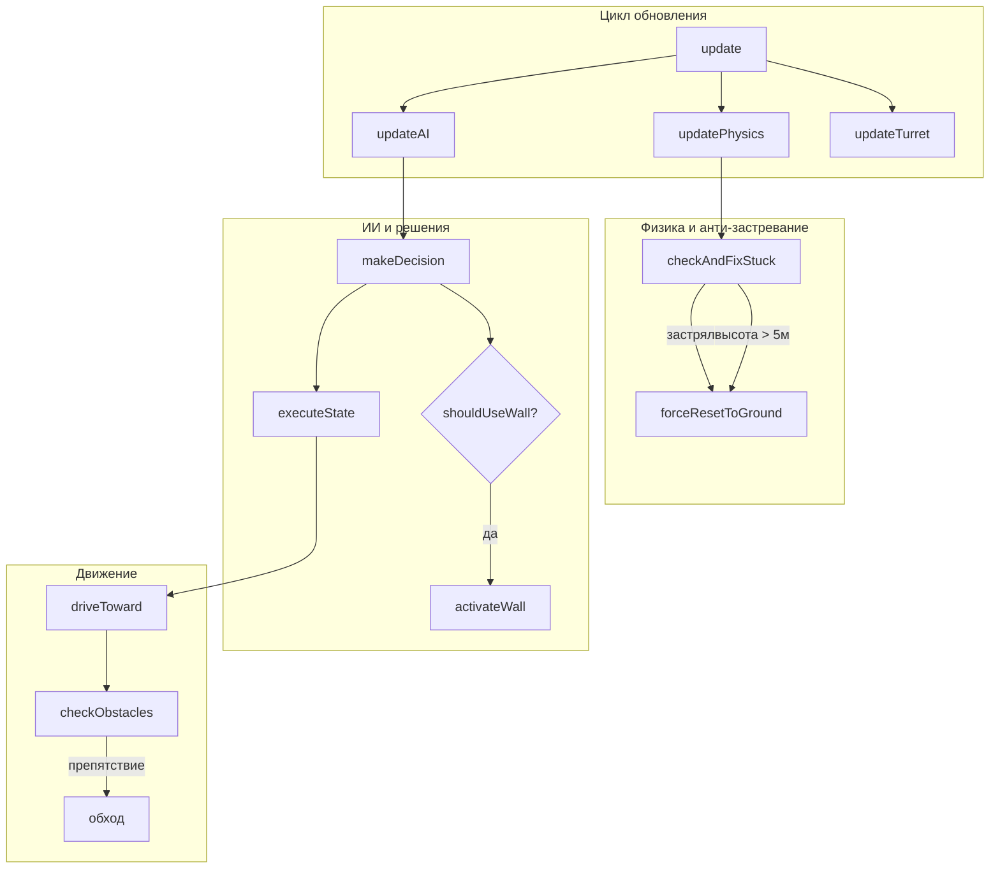
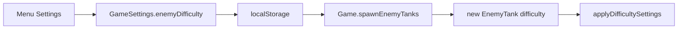

# Оптимизация ИИ врагов

## Анализ текущих проблем

### Диагностика застревания

Боты застревают на крыше гаража (высота ~8м) по следующим причинам:

1. Отсутствует проверка высоты в `updatePhysics()` - hover-механика работает некорректно на высоте
2. `driveToward()` не проверяет препятствия перед движением
3. `reset()` телепортирует в первую точку патруля, которая может быть недоступна

### Диагностика поведения

Текущие настройки делают ботов пассивными:

- `moveSpeed = 8-12` (слишком медленно)
- `decisionInterval = 500-1000ms` (редкие решения)
- Порог отступления 15% HP (слишком рано)
- Нет активного использования укрытий или защитных способностей

---

## Решение 1: Система обхода препятствий и анти-застревание

### Новые поля класса

```typescript
// Анти-застревание
private stuckTimer = 0;
private lastStuckCheckPos = new Vector3();
private readonly STUCK_CHECK_INTERVAL = 1000; // мс
private readonly STUCK_THRESHOLD = 2.0; // минимальное перемещение за интервал
private consecutiveStuckCount = 0;

// Obstacle avoidance
private obstacleAvoidanceDir = 0; // -1 = лево, 0 = прямо, 1 = право
private lastObstacleCheck = 0;
private readonly OBSTACLE_CHECK_INTERVAL = 200; // мс
```

### Метод checkAndFixStuck() - вызывать в updatePhysics()

```typescript
private checkAndFixStuck(): boolean {
    const now = Date.now();
    if (now - this.stuckTimer < this.STUCK_CHECK_INTERVAL) return false;
    
    const pos = this.chassis.position;
    
    // Проверка 1: Высота выше нормы (застряли на крыше)
    if (pos.y > 5.0) {
        console.log(`[EnemyTank ${this.id}] Stuck on roof, resetting`);
        this.forceResetToGround();
        return true;
    }
    
    // Проверка 2: Не двигаемся
    const moved = Vector3.Distance(pos, this.lastStuckCheckPos);
    if (moved < this.STUCK_THRESHOLD && this.throttleTarget !== 0) {
        this.consecutiveStuckCount++;
        if (this.consecutiveStuckCount >= 3) {
            console.log(`[EnemyTank ${this.id}] Stuck in place, forcing unstuck`);
            this.forceUnstuck();
            this.consecutiveStuckCount = 0;
            return true;
        }
    } else {
        this.consecutiveStuckCount = 0;
    }
    
    this.lastStuckCheckPos.copyFrom(pos);
    this.stuckTimer = now;
    return false;
}
```

### Метод forceResetToGround()

```typescript
private forceResetToGround(): void {
    const pos = this.chassis.position.clone();
    pos.y = 2.0; // Стандартная высота hover
    
    this.physicsBody.setLinearVelocity(Vector3.Zero());
    this.physicsBody.setAngularVelocity(Vector3.Zero());
    this.chassis.position.copyFrom(pos);
    
    // Небольшой импульс вниз для стабилизации
    this.physicsBody.applyImpulse(new Vector3(0, -5000, 0), pos);
}
```

### Метод checkObstacles() - raycast в 3 направлениях

```typescript
private checkObstacles(): number {
    const now = Date.now();
    if (now - this.lastObstacleCheck < this.OBSTACLE_CHECK_INTERVAL) {
        return this.obstacleAvoidanceDir;
    }
    this.lastObstacleCheck = now;
    
    const pos = this.chassis.absolutePosition;
    const forward = this.chassis.getDirection(Vector3.Forward()).normalize();
    const right = this.chassis.getDirection(Vector3.Right()).normalize();
    
    const rayLength = 12;
    const rayHeight = pos.y + 0.5;
    const rayStart = new Vector3(pos.x, rayHeight, pos.z);
    
    // Три луча: прямо, влево-вперёд (45°), вправо-вперёд (45°)
    const directions = [
        forward,
        forward.add(right.scale(-0.7)).normalize(),
        forward.add(right.scale(0.7)).normalize()
    ];
    
    const hits = directions.map(dir => {
        const ray = new Ray(rayStart, dir, rayLength);
        const pick = this.scene.pickWithRay(ray, mesh => {
            if (!mesh || !mesh.isEnabled()) return false;
            const meta = mesh.metadata;
            if (meta && (meta.type === "enemyTank" || meta.type === "bullet")) return false;
            return mesh.isPickable;
        });
        return pick && pick.hit ? pick.distance : rayLength;
    });
    
    // Выбираем направление с наибольшим свободным пространством
    if (hits[0] < 8) { // Препятствие впереди
        this.obstacleAvoidanceDir = hits[1] > hits[2] ? -1 : 1;
    } else {
        this.obstacleAvoidanceDir = 0;
    }
    
    return this.obstacleAvoidanceDir;
}
```

### Обновлённый driveToward()

```typescript
private driveToward(targetPos: Vector3, speedMult: number): void {
    // Проверяем препятствия
    const avoidDir = this.checkObstacles();
    
    const pos = this.chassis.absolutePosition;
    let direction = targetPos.subtract(pos);
    direction.y = 0;
    
    if (direction.length() < 0.5) {
        this.throttleTarget = 0;
        this.steerTarget = 0;
        return;
    }
    
    direction.normalize();
    
    // Если есть препятствие, корректируем направление
    if (avoidDir !== 0) {
        const right = new Vector3(direction.z, 0, -direction.x);
        direction = direction.add(right.scale(avoidDir * 0.6)).normalize();
        speedMult *= 0.7; // Замедляемся при обходе
    }
    
    // ... остальная логика как раньше ...
}
```

---

## Решение 2: Повышение агрессивности

### Обновлённые настройки сложности

```typescript
private applyDifficultySettings() {
    switch (this.difficulty) {
        case "easy":
            this.cooldown = 3500;      // было 4000
            this.aimAccuracy = 0.70;   // было 0.65
            this.moveSpeed = 10;       // было 8
            this.decisionInterval = 800; // было 1000
            break;
        case "medium":
            this.cooldown = 2500;      // было 3000
            this.aimAccuracy = 0.85;   // было 0.80
            this.moveSpeed = 14;       // было 10
            this.decisionInterval = 500; // было 700
            break;
        case "hard":
            this.cooldown = 2000;      // было 2500
            this.aimAccuracy = 0.95;
            this.moveSpeed = 18;       // было 12
            this.decisionInterval = 300; // было 500
            break;
    }
}
```

### Обновлённые пороги в makeDecision()

```typescript
// Retreat только при критическом HP (было 15%)
if (healthPercent < 0.10) {
    this.state = "retreat";
    return;
}

// Evade реже, но эффективнее (было 40% HP)
if (healthPercent < 0.25 && distance < 20) {
    if (Math.random() < 0.4) {
        this.state = "evade";
        // + активировать стенку если доступна
        return;
    }
}

// Больше шанс фланга (было 10-25%)
const flankChance = distance > 25 && distance < 50 ? 0.35 : 0.20;
```

### Улучшенный doAttack() - микро-маневры

```typescript
private doAttack(): void {
    // ... существующий код ...
    
    // Добавляем случайные микро-маневры каждые 2 секунды
    if (this._tick % 60 === 0) {
        const microManeuver = (Math.random() - 0.5) * 0.6;
        this.steerTarget += microManeuver;
    }
    
    // Агрессивное сближение при преимуществе HP
    if (healthPercent > 0.6 && targetHealthPercent < 0.4) {
        // Добить раненую цель
        this.driveToward(targetPos, 0.8);
    }
}
```

---

## Решение 3: Модуль защитной стенки

### Новые поля класса

```typescript
// Защитная стенка
private wallMesh: Mesh | null = null;
private wallPhysics: PhysicsBody | null = null;
private wallHealth = 100;
private readonly WALL_MAX_HEALTH = 100;
private lastWallTime = 0;
private readonly WALL_COOLDOWN = 18000; // 18 секунд
private readonly WALL_DURATION = 8000;  // 8 секунд
private wallTimeout: number = 0;
```

### Метод canUseWall()

```typescript
private canUseWall(): boolean {
    const now = Date.now();
    
    // Кулдаун не прошёл
    if (now - this.lastWallTime < this.WALL_COOLDOWN) return false;
    
    // Уже есть активная стенка
    if (this.wallMesh && !this.wallMesh.isDisposed()) return false;
    
    // Нет цели или цель далеко
    if (!this.target || !this.target.chassis) return false;
    const dist = Vector3.Distance(this.chassis.position, this.target.chassis.position);
    if (dist > 60 || dist < 10) return false;
    
    return true;
}
```

### Метод shouldUseWall() - тактическое решение

```typescript
private shouldUseWall(): boolean {
    if (!this.canUseWall()) return false;
    
    const healthPercent = this.currentHealth / this.maxHealth;
    
    // Приоритет 1: Критически низкое здоровье при бое
    if (healthPercent < 0.35 && this.state === "attack") return true;
    
    // Приоритет 2: Отступление/уклонение
    if ((this.state === "retreat" || this.state === "evade") && healthPercent < 0.5) {
        return Math.random() < 0.6; // 60% шанс
    }
    
    // Приоритет 3: Перезарядка под огнём
    if (this.isReloading && healthPercent < 0.6) {
        return Math.random() < 0.3; // 30% шанс
    }
    
    return false;
}
```

### Метод activateWall() - создание стенки

```typescript
private activateWall(): void {
    if (!this.chassis || !this.target) return;
    
    this.lastWallTime = Date.now();
    
    // Позиция между ботом и целью
    const myPos = this.chassis.absolutePosition;
    const targetPos = this.target.chassis.absolutePosition;
    const toTarget = targetPos.subtract(myPos).normalize();
    
    const wallPos = myPos.add(toTarget.scale(5));
    wallPos.y = 2.0; // Центр стенки
    
    // Создаём стенку
    this.wallMesh = MeshBuilder.CreateBox(`enemyWall_${this.id}`, {
        width: 5,
        height: 3.5,
        depth: 0.4
    }, this.scene);
    
    this.wallMesh.position.copyFrom(wallPos);
    this.wallMesh.rotation.y = Math.atan2(toTarget.x, toTarget.z);
    
    // Материал (тёмно-красный, как и танк)
    const mat = new StandardMaterial(`enemyWallMat_${this.id}`, this.scene);
    mat.diffuseColor = new Color3(0.4, 0.1, 0.1);
    mat.emissiveColor = new Color3(0.2, 0.05, 0.05);
    this.wallMesh.material = mat;
    
    this.wallMesh.metadata = { type: "enemyWall", owner: this };
    this.wallHealth = this.WALL_MAX_HEALTH;
    
    // Физика
    const shape = new PhysicsShape({
        type: PhysicsShapeType.BOX,
        parameters: { extents: new Vector3(5, 3.5, 0.4) }
    }, this.scene);
    shape.filterMembershipMask = 64; // Стенки врагов
    shape.filterCollideMask = 1 | 2 | 4; // Игрок, окружение, пули игрока
    
    this.wallPhysics = new PhysicsBody(this.wallMesh, PhysicsMotionType.STATIC, false, this.scene);
    this.wallPhysics.shape = shape;
    
    // Таймер удаления
    this.wallTimeout = window.setTimeout(() => this.destroyWall(), this.WALL_DURATION);
    
    console.log(`[EnemyTank ${this.id}] Wall activated!`);
}
```

### Интеграция в makeDecision()

```typescript
private makeDecision(distance: number): void {
    // Проверяем использование стенки в начале
    if (this.shouldUseWall()) {
        this.activateWall();
    }
    
    // ... остальная логика ...
}
```

---

## Схема взаимодействия



---

## Решение 4: Настройка сложности противников в меню

### Изменения в GameSettings (menu.ts)

```typescript
// Добавить в интерфейс GameSettings (строка ~33)
export interface GameSettings {
    // ... существующие поля ...
    enemyDifficulty: "easy" | "medium" | "hard";  // НОВОЕ
}

// Добавить в DEFAULT_SETTINGS (строка ~53)
const DEFAULT_SETTINGS: GameSettings = {
    // ... существующие поля ...
    enemyDifficulty: "medium"  // НОВОЕ - средняя по умолчанию
};
```

### Добавить UI элемент в createSettingsUI()

```typescript
// Добавить в HTML панели настроек (после блока с языком, ~строка 1720)
<div class="settings-row">
    <span class="setting-label">Сложность ботов</span>
    <div class="difficulty-selector">
        <button class="diff-btn ${this.settings.enemyDifficulty === 'easy' ? 'active' : ''}" 
                id="diff-easy" data-diff="easy">ЛЕГКО</button>
        <button class="diff-btn ${this.settings.enemyDifficulty === 'medium' ? 'active' : ''}" 
                id="diff-medium" data-diff="medium">СРЕДНЕ</button>
        <button class="diff-btn ${this.settings.enemyDifficulty === 'hard' ? 'active' : ''}" 
                id="diff-hard" data-diff="hard">СЛОЖНО</button>
    </div>
</div>
```

### Стили для кнопок сложности

```css
.difficulty-selector {
    display: flex;
    gap: 8px;
}

.diff-btn {
    padding: 8px 16px;
    background: rgba(0, 40, 0, 0.8);
    border: 2px solid #0a0;
    color: #0f0;
    font-family: 'Press Start 2P', monospace;
    font-size: 10px;
    cursor: pointer;
    transition: all 0.2s;
}

.diff-btn:hover {
    background: rgba(0, 80, 0, 0.8);
}

.diff-btn.active {
    background: #0a0;
    color: #000;
    box-shadow: 0 0 10px #0f0;
}

/* Цветовая индикация сложности */
#diff-easy.active { background: #0a0; border-color: #0f0; }
#diff-medium.active { background: #aa0; border-color: #ff0; color: #000; }
#diff-hard.active { background: #a00; border-color: #f00; color: #fff; }
```

### Обработчики событий

```typescript
// Добавить после создания панели настроек
["easy", "medium", "hard"].forEach(diff => {
    document.getElementById(`diff-${diff}`)?.addEventListener("click", () => {
        this.settings.enemyDifficulty = diff as "easy" | "medium" | "hard";
        // Обновляем активную кнопку
        document.querySelectorAll(".diff-btn").forEach(btn => btn.classList.remove("active"));
        document.getElementById(`diff-${diff}`)?.classList.add("active");
    });
});
```

### Обновить saveSettingsFromUI()

```typescript
private saveSettingsFromUI(): void {
    this.settings = {
        // ... существующие поля ...
        enemyDifficulty: this.settings.enemyDifficulty  // Сохраняем выбор
    };
    // ...
}
```

### Добавить строки локализации

```typescript
// В LANG.ru (~строка 74)
enemyDifficulty: "Сложность ботов",
diffEasy: "ЛЕГКО",
diffMedium: "СРЕДНЕ", 
diffHard: "СЛОЖНО",

// В LANG.en (~строка 131)
enemyDifficulty: "Bot Difficulty",
diffEasy: "EASY",
diffMedium: "MEDIUM",
diffHard: "HARD",
```

### Изменения в game.ts - передача сложности

```typescript
// В spawnEnemyTanks() (~строка 1187)
// Было:
const enemyTank = new EnemyTank(this.scene, pos, this.soundManager!, this.effectsManager!, "hard");

// Станет:
const difficulty = this.mainMenu?.getSettings().enemyDifficulty || "medium";
const enemyTank = new EnemyTank(this.scene, pos, this.soundManager!, this.effectsManager!, difficulty);

// Аналогично в respawnEnemyTank() (~строка 1669)
const difficulty = this.mainMenu?.getSettings().enemyDifficulty || "medium";
const enemyTank = new EnemyTank(this.scene, pos, this.soundManager, this.effectsManager, difficulty);
```

### Схема передачи настройки



---

## Файлы для изменения

| Файл | Изменения |

|------|-----------|

| [src/client/enemyTank.ts](src/client/enemyTank.ts) | Все изменения ИИ, физики, стенки |

| [src/client/menu.ts](src/client/menu.ts) | GameSettings, UI выбора сложности, локализация |

| [src/client/game.ts](src/client/game.ts) | Передача сложности в EnemyTank |

---

## Порядок реализации

1. **Анти-застревание** (критично для playability)
2. **Obstacle avoidance** (улучшает навигацию)  
3. **Настройка сложности в меню** (пользовательский контроль)
4. **Агрессивность** (баланс боя)
5. **Модуль стенки** (тактическая глубина)

---

## Описание уровней сложности

| Уровень | Скорость | Точность | Перезарядка | Поведение |

|---------|----------|----------|-------------|-----------|

| **Легко** | 10 | 70% | 3.5с | Медленные решения, раннее отступление |

| **Средне** | 14 | 85% | 2.5с | Сбалансированное поведение |

| **Сложно** | 18 | 95% | 2.0с | Агрессивные, используют стенки, редко отступают |

---

## Дополнительные улучшения живости ботов

### Микро-поведения для реалистичности

```typescript
// Случайные повороты башни при патрулировании (сканирование)
private doPatrolScan(): void {
    if (this.state === "patrol" && this._tick % 90 === 0) {
        // Случайный поворот башни ±60°
        this.turretTargetAngle += (Math.random() - 0.5) * 1.0;
    }
}

// Реакция на получение урона - резкий разворот
private onDamageReaction(): void {
    if (this.target && Math.random() < 0.5) {
        // 50% шанс резкого маневра при получении урона
        this.steerTarget = Math.random() > 0.5 ? 1.0 : -1.0;
        this.throttleTarget = 0.8;
    }
}
```

### Улучшенное предсказание движения цели

```typescript
private aimAtTarget(): void {
    // ... существующий код ...
    
    // Учитываем ускорение цели (вторая производная)
    const targetAccel = this.targetVelocity.subtract(this.lastTargetVelocity);
    this.lastTargetVelocity = this.targetVelocity.clone();
    
    // Предсказание с учётом ускорения
    const predictedPos = targetPos
        .add(this.targetVelocity.scale(flightTime * 0.7))
        .add(targetAccel.scale(flightTime * flightTime * 0.3));
}
```

---

## Тестирование

После реализации проверить:

1. **Застревание**: Боты не застревают на крышах гаражей и в стенах
2. **Навигация**: Боты обходят препятствия плавно
3. **Агрессивность**: Боты активно атакуют, не отступают слишком рано
4. **Стенки**: Боты используют стенки тактически грамотно
5. **Меню**: Настройка сложности работает и применяется к новым ботам
6. **Производительность**: FPS не падает при 10+ ботах на экране